# Go-Store — Technical Documentation

> A production-grade cloud file storage REST API built with Go 1.21, Gin, PostgreSQL, and AWS S3 / Google Cloud Storage.

---

## Table of Contents

1. [Overview](#1-overview)
2. [Architecture](#2-architecture)
   - 2.1 [High-Level System Diagram](#21-high-level-system-diagram)
   - 2.2 [Internal Package Structure](#22-internal-package-structure)
   - 2.3 [Dependency Injection Chain](#23-dependency-injection-chain)
3. [Data Model](#3-data-model)
   - 3.1 [Entity-Relationship Diagram](#31-entity-relationship-diagram)
   - 3.2 [Table Definitions](#32-table-definitions)
4. [Authentication & Security](#4-authentication--security)
   - 4.1 [JWT Token Derivation](#41-jwt-token-derivation)
   - 4.2 [Request Authentication Flow](#42-request-authentication-flow)
   - 4.3 [Password Hashing](#43-password-hashing)
5. [API Reference](#5-api-reference)
   - 5.1 [Auth Endpoints](#51-auth-endpoints)
   - 5.2 [User Endpoints](#52-user-endpoints)
   - 5.3 [File Endpoints](#53-file-endpoints)
   - 5.4 [Health Check](#54-health-check)
   - 5.5 [Error Response Shape](#55-error-response-shape)
6. [Request / Response Flows](#6-request--response-flows)
   - 6.1 [Register & Login](#61-register--login)
   - 6.2 [File Upload](#62-file-upload)
   - 6.3 [File Delete](#63-file-delete)
7. [Storage Layer](#7-storage-layer)
   - 7.1 [Storage Interface](#71-storage-interface)
   - 7.2 [Object Key Convention](#72-object-key-convention)
   - 7.3 [Choosing a Provider](#73-choosing-a-provider)
8. [Database](#8-database)
   - 8.1 [Connection Pool Settings](#81-connection-pool-settings)
   - 8.2 [Migration Workflow](#82-migration-workflow)
9. [Server Lifecycle](#9-server-lifecycle)
   - 9.1 [Startup Sequence](#91-startup-sequence)
   - 9.2 [Graceful Shutdown](#92-graceful-shutdown)
10. [Configuration Reference](#10-configuration-reference)
11. [Local Development](#11-local-development)
12. [Docker & Docker Compose](#12-docker--docker-compose)
13. [Deployment](#13-deployment)
14. [Project File Tree](#14-project-file-tree)

---

## 1. Overview

Go-Store is a RESTful HTTP API that lets users:

- **Register and authenticate** using email/password (OAuth-style) or as anonymous sessions.
- **Upload files** to Amazon S3 or Google Cloud Storage with automatic object-key namespacing.
- **Manage file metadata** (list, read, rename, delete) stored in PostgreSQL.
- **Control access** at the file level through a granular permissions model.

The system is built on a strict layered architecture — HTTP handlers never touch the database, business logic never knows about HTTP, and every layer is wired together through constructor injection with no global state.

---

## 2. Architecture

### 2.1 High-Level System Diagram

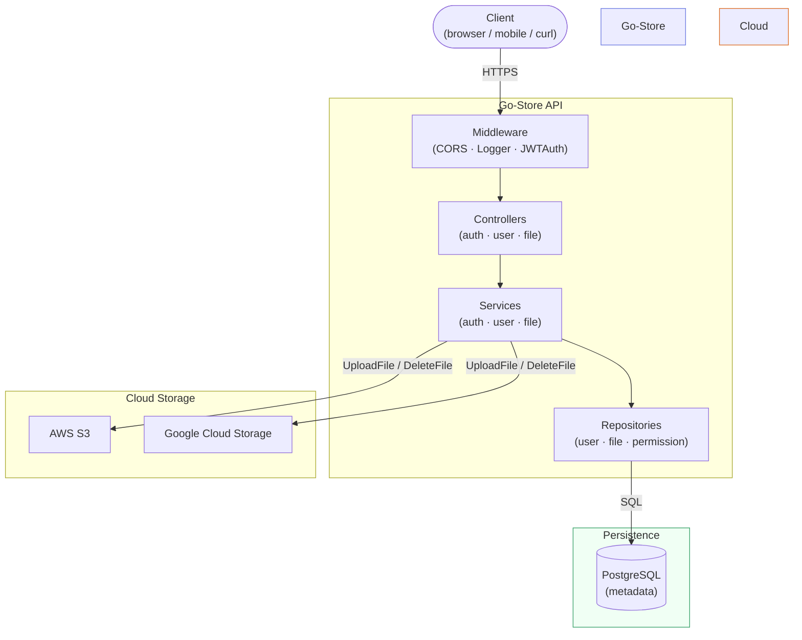

### 2.2 Internal Package Structure

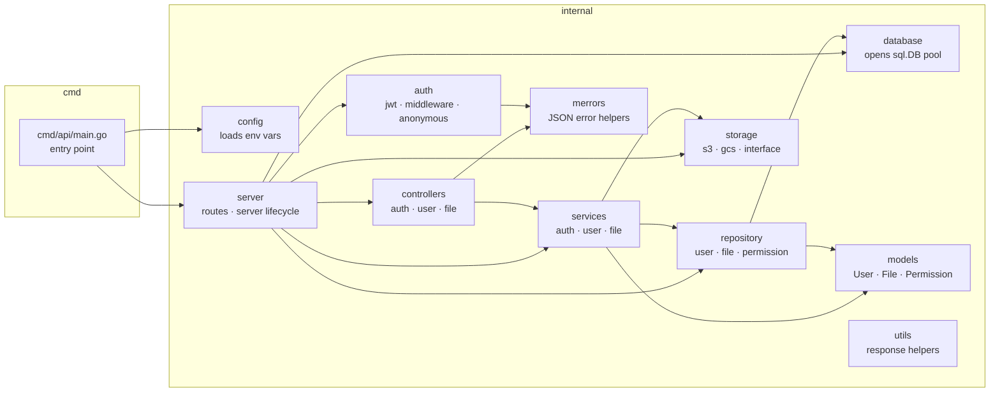

### 2.3 Dependency Injection Chain

Everything is wired in `internal/server/routes.go`. No global singletons, no `init()` side-effects.

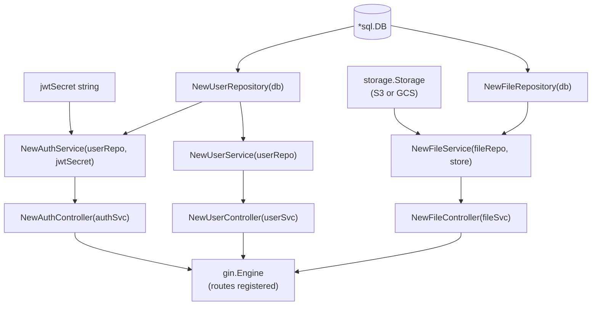

---

## 3. Data Model

### 3.1 Entity-Relationship Diagram

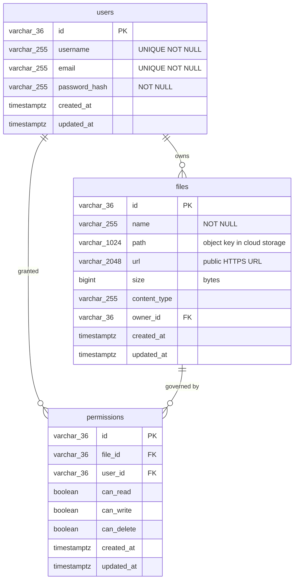

### 3.2 Table Definitions

#### `users`

| Column | Type | Constraints | Notes |
|--------|------|-------------|-------|
| `id` | `VARCHAR(36)` | PK | UUID v4 |
| `username` | `VARCHAR(255)` | NOT NULL, UNIQUE | |
| `email` | `VARCHAR(255)` | NOT NULL, UNIQUE | Indexed |
| `password_hash` | `VARCHAR(255)` | NOT NULL | bcrypt, cost 10 |
| `created_at` | `TIMESTAMPTZ` | NOT NULL, DEFAULT NOW() | |
| `updated_at` | `TIMESTAMPTZ` | NOT NULL, DEFAULT NOW() | |

**Indexes:** `idx_users_email`, `idx_users_username`

#### `files`

| Column | Type | Constraints | Notes |
|--------|------|-------------|-------|
| `id` | `VARCHAR(36)` | PK | UUID v4 |
| `name` | `VARCHAR(255)` | NOT NULL | Original filename |
| `path` | `VARCHAR(1024)` | NOT NULL | Cloud storage object key |
| `url` | `VARCHAR(2048)` | NOT NULL | Public HTTPS URL |
| `size` | `BIGINT` | NOT NULL, DEFAULT 0 | Bytes |
| `content_type` | `VARCHAR(255)` | NOT NULL, DEFAULT '' | MIME type |
| `owner_id` | `VARCHAR(36)` | NOT NULL, FK → users.id | CASCADE DELETE |
| `created_at` | `TIMESTAMPTZ` | NOT NULL, DEFAULT NOW() | |
| `updated_at` | `TIMESTAMPTZ` | NOT NULL, DEFAULT NOW() | |

**Indexes:** `idx_files_owner_id`

#### `permissions`

| Column | Type | Constraints | Notes |
|--------|------|-------------|-------|
| `id` | `VARCHAR(36)` | PK | UUID v4 |
| `file_id` | `VARCHAR(36)` | NOT NULL, FK → files.id | CASCADE DELETE |
| `user_id` | `VARCHAR(36)` | NOT NULL, FK → users.id | CASCADE DELETE |
| `can_read` | `BOOLEAN` | NOT NULL, DEFAULT FALSE | |
| `can_write` | `BOOLEAN` | NOT NULL, DEFAULT FALSE | |
| `can_delete` | `BOOLEAN` | NOT NULL, DEFAULT FALSE | |
| `created_at` | `TIMESTAMPTZ` | NOT NULL, DEFAULT NOW() | |
| `updated_at` | `TIMESTAMPTZ` | NOT NULL, DEFAULT NOW() | |

**Unique constraint:** `(file_id, user_id)` — one permission row per user per file.  
**Indexes:** `idx_permissions_file_id`, `idx_permissions_user_id`

---

## 4. Authentication & Security

### 4.1 JWT Token Derivation

Go-Store does **not** sign all tokens with the same key. Instead a unique signing key is derived for every token:

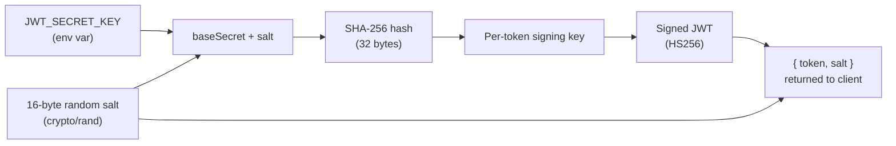

**Why this matters:** even if an attacker intercepts a token+salt pair and reverse-engineers the signing key for that pair, they cannot sign a new token with a different subject — every token needs its own salt, so no two tokens share a key.

Tokens expire after **24 hours**. The expiry is embedded in the JWT `exp` claim and enforced during `ValidateToken`.

### 4.2 Request Authentication Flow

All routes under `/v1/users` and `/v1/files` require two headers:

```
Authorization: Bearer <jwt_token>
X-Salt: <salt>
```

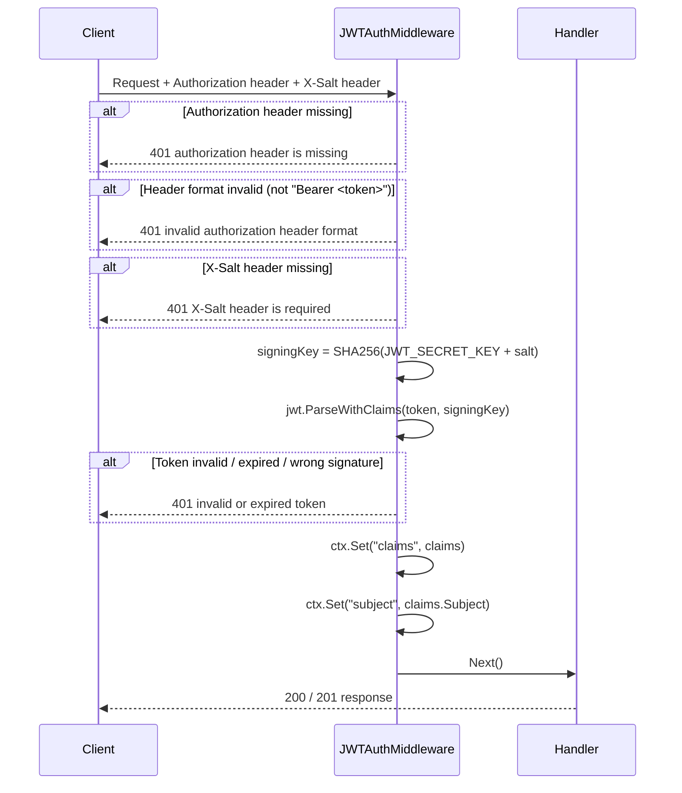

### 4.3 Password Hashing

Passwords are hashed with **bcrypt at cost 10** (`bcrypt.DefaultCost`) inside `models.NewUser` and `models.User.SetPassword`. The plain-text password is never stored, logged, or returned in any JSON response — the `PasswordHash` field is tagged `json:"-"`.

---

## 5. API Reference

### Base URL

```
http://localhost:8080
```

### Authentication Headers (protected routes only)

| Header | Value |
|--------|-------|
| `Authorization` | `Bearer <token>` |
| `X-Salt` | `<salt>` |

Both `token` and `salt` are returned by any login or register endpoint.

---

### 5.1 Auth Endpoints

All auth endpoints are **public** (no authentication required).

#### `POST /v1/auth/oauth/register`

Register a new user account.

**Request body** (`application/json`):

```json
{
  "username": "alice",
  "email": "alice@example.com",
  "password": "s3cur3pass"
}
```

| Field | Type | Constraints |
|-------|------|-------------|
| `username` | string | required |
| `email` | string | required, valid email |
| `password` | string | required, min 8 chars |

**Response `201`:**

```json
{
  "user": {
    "id": "550e8400-e29b-41d4-a716-446655440000",
    "username": "alice",
    "email": "alice@example.com",
    "created_at": "2025-01-01T12:00:00Z",
    "updated_at": "2025-01-01T12:00:00Z"
  },
  "token": "<jwt>",
  "salt": "<base64-salt>"
}
```

**Errors:** `409 Conflict` if email already exists, `422 Unprocessable Entity` on validation failure.

---

#### `POST /v1/auth/oauth/login`

Authenticate an existing user.

**Request body** (`application/json`):

```json
{
  "email": "alice@example.com",
  "password": "s3cur3pass"
}
```

**Response `200`:**

```json
{
  "user": { "id": "...", "username": "alice", "email": "alice@example.com", "..." },
  "token": "<jwt>",
  "salt": "<base64-salt>"
}
```

**Errors:** `401 Unauthorized` on wrong credentials (message is intentionally generic to prevent user enumeration).

---

#### `POST /v1/auth/anonymous/register`

Create a temporary anonymous session. No user record is persisted; the `anonymous_id` is the JWT subject.

**Response `201`:**

```json
{
  "anonymous_id": "anon_550e8400-...",
  "token": "<jwt>",
  "salt": "<base64-salt>"
}
```

---

#### `POST /v1/auth/logout`

Client-side logout. The server returns 200. Token invalidation is **stateless** — to enforce server-side revocation, add a Redis token blacklist keyed by `jti` or `subject+iat`.

**Response `200`:**

```json
{ "message": "logged out successfully" }
```

---

#### `GET /v1/auth/validate?token=<jwt>&salt=<salt>`

Validate a JWT without a protected resource request.

**Query parameters:**

| Param | Required |
|-------|----------|
| `token` | yes |
| `salt` | yes |

**Response `200`:**

```json
{ "subject": "550e8400-...", "valid": true }
```

**Errors:** `401 Unauthorized` if the token is expired or the signature is invalid.

---

### 5.2 User Endpoints

All user endpoints require authentication headers.

#### `POST /v1/users`

Create a new user (admin use-case; regular users register via `/v1/auth/oauth/register`).

**Request body:**

```json
{
  "username": "bob",
  "email": "bob@example.com",
  "password": "password123"
}
```

**Response `201`:** Full user object (password omitted).

---

#### `GET /v1/users/:id`

Fetch a user by UUID.

**Response `200`:**

```json
{
  "data": {
    "id": "...",
    "username": "alice",
    "email": "alice@example.com",
    "created_at": "...",
    "updated_at": "..."
  }
}
```

**Errors:** `404 Not Found`.

---

#### `PUT /v1/users/:id`

Update mutable user fields. All fields are optional — only non-empty values are applied.

**Request body:**

```json
{
  "username": "alice2",
  "email": "newemail@example.com",
  "password": "newpassword123"
}
```

**Response `200`:** Updated user object.

---

#### `DELETE /v1/users/:id`

Permanently delete a user and cascade-delete all their files and permissions.

**Response `200`:**

```json
{ "message": "user deleted successfully" }
```

---

### 5.3 File Endpoints

All file endpoints require authentication headers.

#### `POST /v1/files`

Upload a file to cloud storage and persist its metadata.

**Request:** `multipart/form-data` with a field named `file`.

```bash
curl -X POST http://localhost:8080/v1/files \
  -H "Authorization: Bearer <token>" \
  -H "X-Salt: <salt>" \
  -F "file=@/path/to/document.pdf"
```

**Response `201`:**

```json
{
  "data": {
    "id": "a1b2c3d4-...",
    "name": "document.pdf",
    "path": "<owner_id>/<file_id>.pdf",
    "url": "https://<bucket>.s3.us-east-1.amazonaws.com/<owner_id>/<file_id>.pdf",
    "size": 204800,
    "content_type": "application/pdf",
    "owner_id": "550e8400-...",
    "created_at": "...",
    "updated_at": "..."
  }
}
```

**Errors:** `400 Bad Request` if no file field provided, `500 Internal Server Error` on storage failure.

---

#### `GET /v1/files`

List all files owned by the authenticated user. Results are ordered by `created_at DESC`.

**Response `200`:**

```json
{
  "data": [
    { "id": "...", "name": "report.xlsx", "url": "...", "size": 51200, "..." },
    { "id": "...", "name": "photo.jpg",   "url": "...", "size": 819200, "..." }
  ]
}
```

Returns an empty array (not `null`) when the user has no files.

---

#### `GET /v1/files/:id`

Fetch metadata for a single file by UUID.

**Response `200`:** Single file object (same shape as above).  
**Errors:** `404 Not Found`.

---

#### `PUT /v1/files/:id`

Update file metadata. Only the **owner** may update their files.

**Request body:**

```json
{
  "name": "new-filename.pdf",
  "content_type": "application/pdf"
}
```

Both fields are optional. Pass only the fields you want to change.

**Response `200`:** Updated file object.  
**Errors:** `403 Forbidden` if the requester is not the owner, `404 Not Found`.

---

#### `DELETE /v1/files/:id`

Delete the cloud storage object **and** the metadata row. Only the owner may delete.

The deletion order is intentional: the cloud object is removed first. If that succeeds but the DB delete fails, the orphaned metadata can be retried. If the cloud delete fails, the metadata is preserved so the operation can be retried cleanly.

**Response `200`:**

```json
{ "message": "file deleted successfully" }
```

**Errors:** `403 Forbidden`, `404 Not Found`.

---

### 5.4 Health Check

#### `GET /healthz`

Unauthenticated. Pings the database and returns its connectivity status.

**Response `200` (healthy):**

```json
{ "status": "ok" }
```

**Response `503` (database unreachable):**

```json
{ "status": "unhealthy", "db": "dial tcp: connection refused" }
```

---

### 5.5 Error Response Shape

Every error response follows this JSON structure:

```json
{
  "error": {
    "code": 404,
    "type": "not_found",
    "message": "file not found"
  }
}
```

| Status | `type` value | Trigger |
|--------|-------------|---------|
| 400 | `bad_request` | Malformed request, missing required field |
| 401 | `unauthorized` | Missing / invalid / expired JWT |
| 403 | `forbidden` | Authenticated but not the resource owner |
| 404 | `not_found` | Resource does not exist |
| 409 | `conflict` | Duplicate email on register |
| 422 | `validation_error` | Input fails binding validation rules |
| 500 | `internal_server_error` | Unexpected server-side error |
| 503 | `service_unavailable` | Upstream dependency down |
| 550 | `downstream_error` | Third-party integration failure |

---

## 6. Request / Response Flows

### 6.1 Register & Login

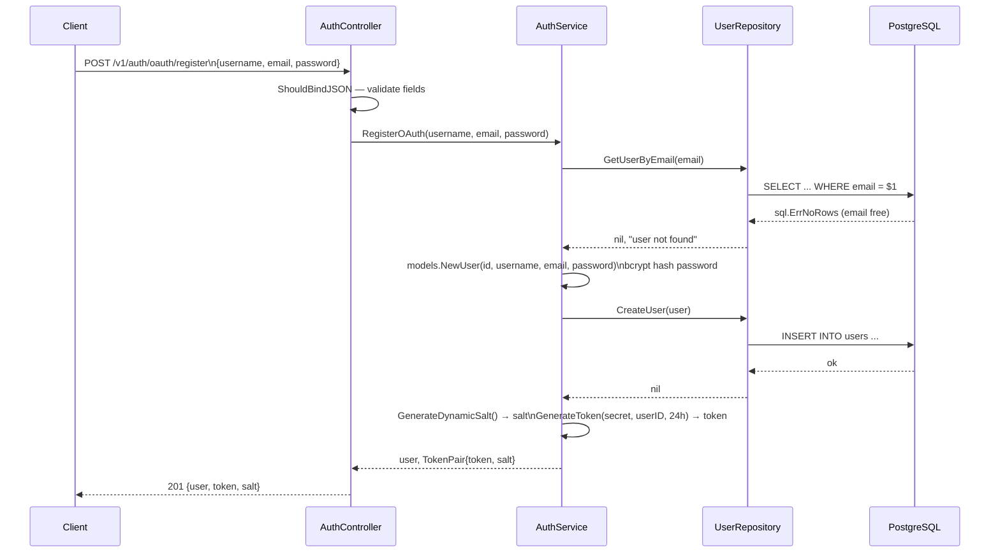

### 6.2 File Upload

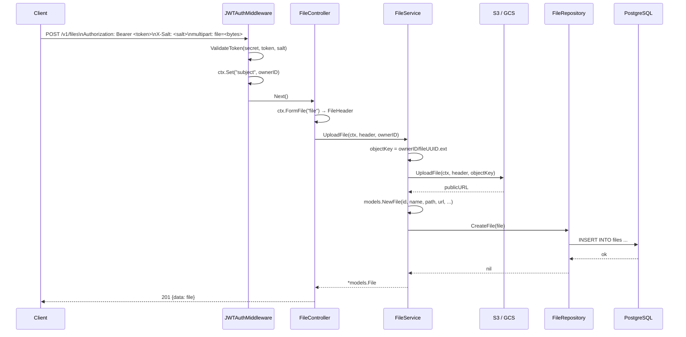

### 6.3 File Delete

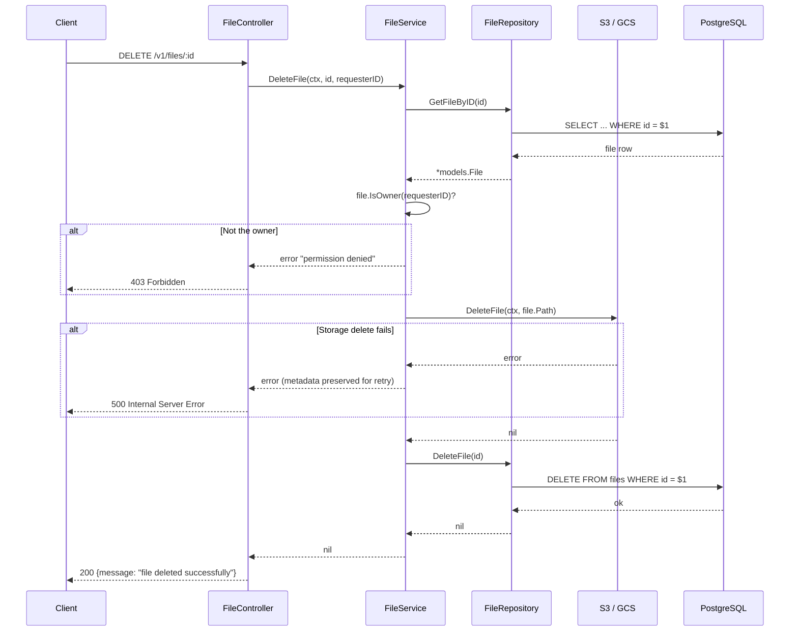

---

## 7. Storage Layer

### 7.1 Storage Interface

Both S3 and GCS implement the same two-method interface defined in `internal/storage/storage.go`:

```go
type Storage interface {
    UploadFile(ctx context.Context, file *multipart.FileHeader, destination string) (string, error)
    DeleteFile(ctx context.Context, objectKey string) error
}
```

`UploadFile` returns the **public HTTPS URL** of the stored object.  
`DeleteFile` accepts the **object key** (the `path` field on a `File` record), not the URL.

Switching providers requires only changing `STORAGE_PROVIDER` in your `.env`. No application code changes.

### 7.2 Object Key Convention

```
<owner_id>/<file_uuid><ext>

Example:
  550e8400-e29b-41d4-a716-446655440000/a1b2c3d4-1234-5678-abcd-ef0123456789.pdf
```

This namespaces every user's files at the prefix level, which makes it straightforward to:
- Apply S3 bucket lifecycle rules per user prefix.
- Set GCS IAM conditions scoped to a prefix.
- Calculate per-user storage usage from a prefix listing.

### 7.3 Choosing a Provider

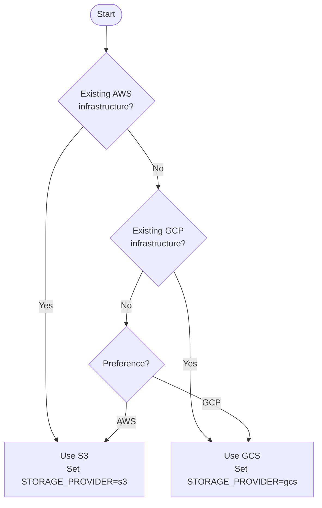

---

## 8. Database

### 8.1 Connection Pool Settings

Set in `internal/database/database.go`:

| Setting | Value | Why |
|---------|-------|-----|
| `MaxOpenConns` | 25 | Caps parallelism; prevents overwhelming the DB |
| `MaxIdleConns` | 25 | Keeps connections warm; avoids reconnect overhead |
| `ConnMaxLifetime` | 5 min | Forces periodic reconnect; handles DB restarts |
| `ConnMaxIdleTime` | 5 min | Returns idle connections to the pool promptly |

After `sql.Open`, the constructor calls `db.Ping()` and returns an error if the database is unreachable — the server fails fast at startup rather than silently serving errors later.

### 8.2 Migration Workflow

Migrations use [golang-migrate](https://github.com/golang-migrate/migrate). Files live in `database/migrations/` and follow the `NNN_description.up.sql` / `NNN_description.down.sql` naming convention.

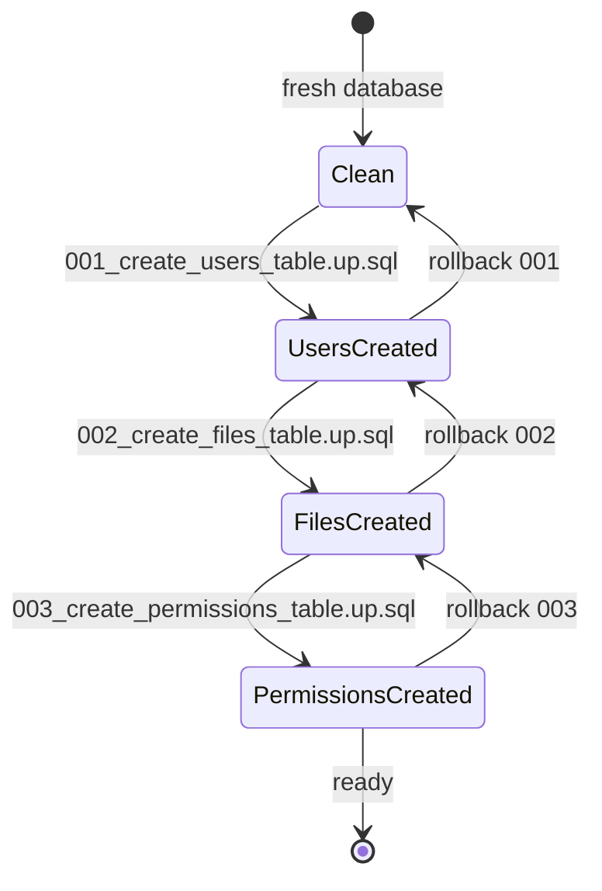

**Commands:**

```bash
# Apply all pending migrations
./scripts/migrate.sh up

# Roll back the last migration
./scripts/migrate.sh rollback

# Drop everything (dev only — destructive)
./scripts/migrate.sh drop
```

---

## 9. Server Lifecycle

### 9.1 Startup Sequence

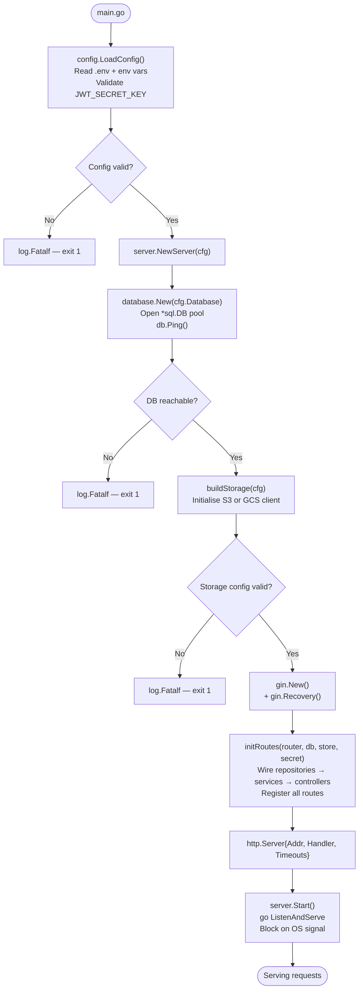

### 9.2 Graceful Shutdown

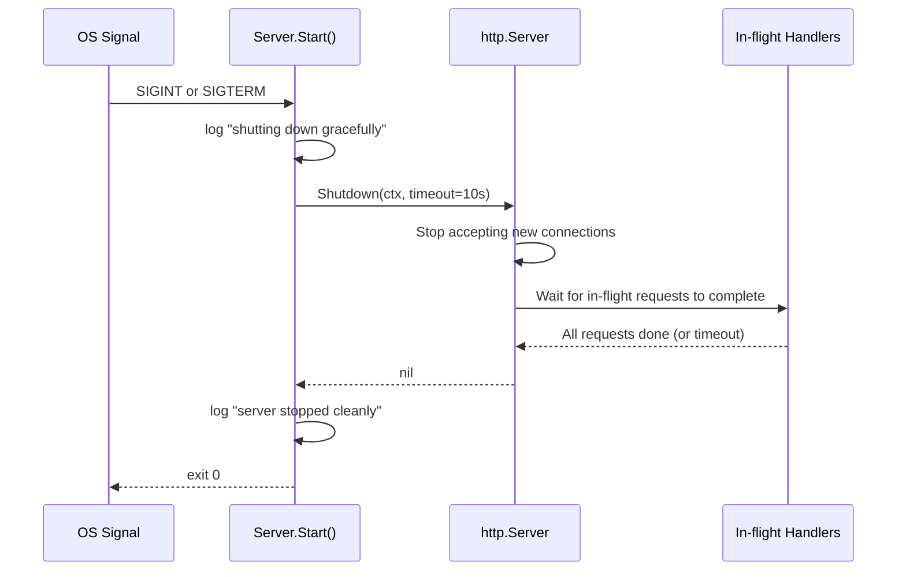

HTTP server timeouts:

| Timeout | Value | Purpose |
|---------|-------|---------|
| `ReadTimeout` | 15 s | Max time to read full request |
| `WriteTimeout` | 15 s | Max time to write full response |
| `IdleTimeout` | 60 s | Max time between keep-alive requests |
| Shutdown | 10 s | Grace period for in-flight requests |

---

## 10. Configuration Reference

Full variable list with defaults and constraints:

| Variable | Required | Default | Description |
|----------|----------|---------|-------------|
| `SERVER_PORT` | No | `8080` | HTTP listen port |
| `APP_ENV` | No | `development` | `development` or `production` |
| `DB_DRIVER` | No | `postgres` | `postgres` or `mysql` |
| `DB_HOST` | No | `localhost` | Database hostname |
| `DB_PORT` | No | `5432` | Database port |
| `DB_DATABASE` | No | `gostore` | Database name |
| `DB_USERNAME` | No | `postgres` | Database user |
| `DB_PASSWORD` | **Yes** | — | Database password |
| `DB_SSL_MODE` | No | `disable` | `disable`, `require`, `verify-full` |
| `JWT_SECRET_KEY` | **Yes** | — | HMAC base secret, min 32 chars |
| `STORAGE_PROVIDER` | No | `s3` | `s3` or `gcs` |
| `AWS_REGION` | S3 only | `us-east-1` | S3 bucket region |
| `AWS_BUCKET_NAME` | S3 only | — | S3 bucket name |
| `AWS_ACCESS_KEY_ID` | S3 only | — | IAM access key |
| `AWS_SECRET_ACCESS_KEY` | S3 only | — | IAM secret key |
| `GOOGLE_CLOUD_PROJECT_ID` | GCS only | — | GCP project ID |
| `GOOGLE_CLOUD_BUCKET_NAME` | GCS only | — | GCS bucket name |
| `GOOGLE_CLOUD_CREDENTIALS_FILE` | GCS only | — | Path to service account JSON |
| `DB_ROOT_PASSWORD` | Compose only | — | Postgres root password (Docker Compose) |

---

## 11. Local Development

**Prerequisites:**
- Go 1.21+
- PostgreSQL 14+ running locally (or via Docker)
- `migrate` CLI: `go install -tags 'postgres' github.com/golang-migrate/migrate/v4/cmd/migrate@latest`
- `task` CLI (optional): https://taskfile.dev

```bash
# 1. Clone
git clone https://github.com/souvik03-136/Go-Store.git
cd Go-Store

# 2. Configure
cp .env.example .env
# Edit .env: set DB_PASSWORD and JWT_SECRET_KEY at minimum

# 3. Migrate
./scripts/migrate.sh up

# 4. Run
go run ./cmd/api
# OR
task run
```

**Available `task` commands:**

| Command | Description |
|---------|-------------|
| `task run` | Run the server (reads `.env`) |
| `task build` | Compile to `bin/api` |
| `task test` | Run all tests with race detector |
| `task test:cover` | Tests + HTML coverage report |
| `task lint` | Run `golangci-lint` |
| `task fmt` | Run `gofmt -w .` |
| `task migrate:up` | Apply pending migrations |
| `task migrate:down` | Roll back last migration |
| `task docker:up` | Start everything with Docker Compose |
| `task docker:down` | Stop Docker Compose stack |
| `task clean` | Remove `bin/` and coverage files |

---

## 12. Docker & Docker Compose

### Dockerfile

The build uses a two-stage Dockerfile:

```mermaid
flowchart LR
    subgraph Stage 1 — builder
        G1["golang:1.21-alpine\n+ ca-certificates + git"]
        G2["go mod download\n(cached layer)"]
        G3["go build -tags netgo\nCGO_ENABLED=0\nStatic binary → bin/api"]
        G1 --> G2 --> G3
    end

    subgraph Stage 2 — runtime
        D1["gcr.io/distroless/static-debian12\n(no shell, no package manager)"]
        D2["COPY bin/api from builder"]
        D3["USER nonroot:nonroot\nEXPOSE 8080\nENTRYPOINT ./api"]
        D1 --> D2 --> D3
    end

    G3 -->|"COPY --from=builder"| D2
```

The final image contains only the static binary and CA certificates — no Go toolchain, no shell, no libc. This minimises the attack surface and image size.

### Docker Compose

`docker-compose.yml` defines two services:

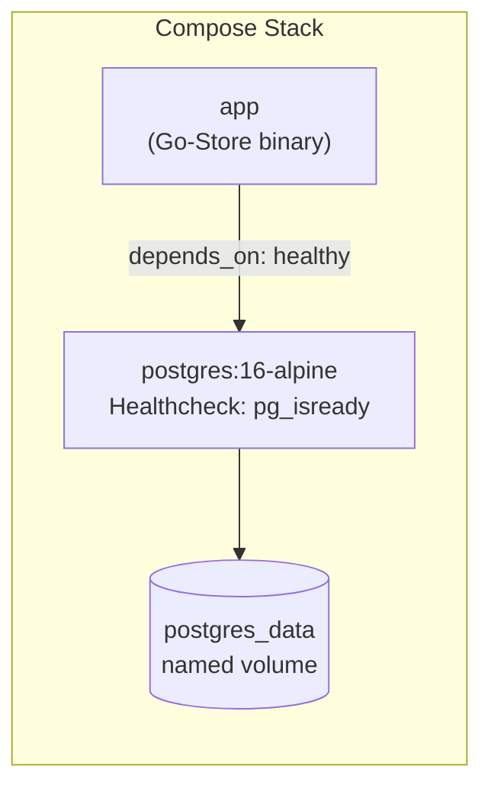

The `app` service uses `depends_on: condition: service_healthy` — it will not start until the Postgres healthcheck (`pg_isready`) passes. This prevents the Go binary from crashing with "connection refused" on a cold start.

```bash
# Start the full stack
docker compose up --build

# Stop and remove containers (data volume is preserved)
docker compose down

# Stop and remove everything including the volume
docker compose down -v
```

---

## 13. Deployment

### Using Docker Compose (recommended)

```bash
# On the target server, with .env populated:
./scripts/deploy.sh
```

`scripts/deploy.sh` will:
1. `git pull origin main`
2. Run `./scripts/migrate.sh up`
3. `docker compose down --remove-orphans`
4. `docker compose build --no-cache`
5. `docker compose up -d`

### Direct binary deployment

```bash
# Build
go build -o bin/api ./cmd/api

# Run (with .env in the working directory)
./bin/api
```

---

## 14. Project File Tree

```
Go-Store/
│
├── cmd/
│   └── api/
│       └── main.go                  Entry point
│
├── internal/
│   ├── auth/
│   │   ├── anonymous.go             GenerateAnonymousID()
│   │   ├── jwt.go                   GenerateToken / ValidateToken
│   │   └── middleware.go            CORS · RequestLogger · JWTAuthMiddleware
│   │
│   ├── config/
│   │   └── config.go                LoadConfig() — reads env vars, validates
│   │
│   ├── controllers/
│   │   ├── auth_controller.go       Register · Login · Anonymous · Logout · Validate
│   │   ├── file_controller.go       Upload · List · Get · Update · Delete
│   │   └── user_controller.go       Create · Get · Update · Delete
│   │
│   ├── database/
│   │   └── database.go              Opens *sql.DB with pool settings
│   │
│   ├── merrors/
│   │   └── merrors.go               BadRequest · Unauthorized · Forbidden ·
│   │                                NotFound · Conflict · Validation ·
│   │                                InternalServer · ServiceUnavailable · Downstream
│   │
│   ├── models/
│   │   ├── file.go                  File struct + NewFile · Rename · IsOwner
│   │   ├── permission.go            Permission struct + helpers
│   │   └── user.go                  User struct + NewUser · CheckPassword · SetPassword
│   │
│   ├── repository/
│   │   ├── file_repository.go       CRUD + ListByOwner
│   │   ├── permission_repository.go CRUD + ListByFile
│   │   └── user_repository.go       CRUD + GetByEmail + GetByUsername
│   │
│   ├── server/
│   │   ├── routes.go                Wires all deps; registers all routes
│   │   └── server.go                NewServer · Start · buildStorage · graceful shutdown
│   │
│   ├── services/
│   │   ├── auth_service.go          RegisterOAuth · LoginOAuth · RegisterAnonymous · ValidateToken
│   │   ├── file_service.go          UploadFile · GetFileByID · ListByOwner · UpdateFile · DeleteFile
│   │   ├── helpers.go               generateID() — UUID helper
│   │   └── user_service.go          CreateUser · GetUserByID · UpdateUser · DeleteUser
│   │
│   ├── storage/
│   │   ├── gcs_storage.go           GCS implementation of Storage interface
│   │   ├── s3_storage.go            S3 implementation of Storage interface
│   │   └── storage.go               Storage interface definition
│   │
│   └── utils/
│       └── response.go              OK() · Created() helpers
│
├── database/
│   └── migrations/
│       ├── 001_create_users_table.up.sql
│       ├── 001_create_users_table.down.sql
│       ├── 002_create_files_table.up.sql
│       ├── 003_create_permissions_table.up.sql
│       └── 002_003_down.sql
│
├── scripts/
│   ├── deploy.sh                    Pull · migrate · rebuild · restart
│   └── migrate.sh                   golang-migrate wrapper (up · rollback · drop)
│
├── .env.example                     Environment variable template
├── .gitignore
├── docker-compose.yml               postgres + app services with healthcheck
├── Dockerfile                       Multi-stage build → distroless runtime
├── go.mod
├── README.md
├── sqlc.yaml                        sqlc config (reference; app uses hand-written SQL)
└── Taskfile.yml                     Dev task runner
```